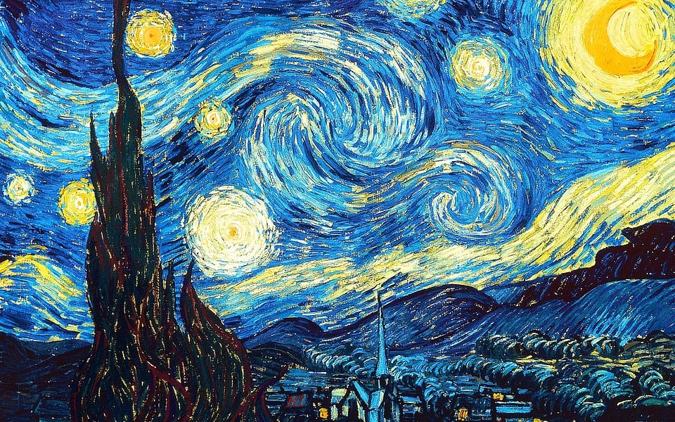
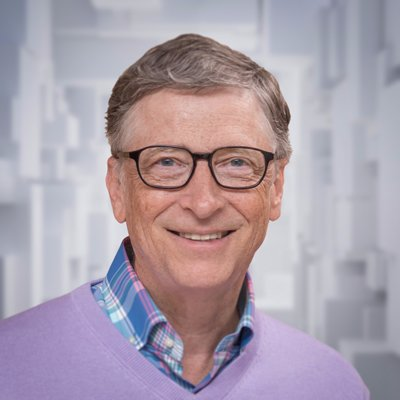

# Sistemas Evolutivos
## :dna: Projeto da disciplina SSC0713 - Sistemas Evolutivos
- **Professor:** Eduardo do Valle Simões

- **Vídeo de Apresentação:** https://youtu.be/A0HkwsQk_fA

O projeto consiste na geração de imagens que evoluem a partir dos conceitos de Algoritmos Genéticos aprendidos em sala de aula. A ideia é evoluir uma imagem do zero para uma imagem escolhida, ou fazer a mescla de duas imagens.

<p align="center">
  
  
</p>

<p align="center">
  <b>Parâmetros:</b><br>
  POP_SIZE: 8<br>
  MAX_GENERATIONS: 20<br>
  MUTATION_RATE: 0.50<br>
  MUTATION_SCALE: 30
</p>

## :scroll: Descrição
O programa ```generator.py``` lê os pixels de uma imagem e a partir disso cria o arquivo ```target.txt```, com um cabeçalho informando as dimensões da imagem seguido de todas as triplas RGB referentes aos pixels. O programa em ```C``` abre este arquivo de texto e a partir dele cria um indivíduo "perfeito", que irá balizar a evolução que se inicia a partir de uma população de pixels totalmente aleatória.

Neste algoritmo, um ```Indivíduo``` é representado por um pixel, e seus genes são representados por sua ```cor```. A cor de um pixel é definida por três valores de 0 a 255, que representam os canais R, G e B. O ```fitness```, ou aptidão, é medido pelo módulo da diferença de sua cor para o indivíduo perfeito. Logo, nesse algoritmo, quanto mais próximo de zero, melhor é o fitness do indivíduo.  

Para cada pixel da imagem original, existe uma população de pixels que pretendem evoluir para ele. No início de cada geração, ocorre um ```genocídio```, que mata metade dos indivíduos, restando apenas os melhores, e estes cruzam entre si a fim de repor a população. O ```crossover```, ou cruzamento, ocorre de forma que o filho herda aleatoriamente os genes (canais de cores) de seus pais. Também há a chance do indivíduo sofrer ```mutação```, em que um de seus genes aleatoriamente é alterado, somando ou subtraindo um valor aleatório a sua cor.

A cada geração, é criado um arquivo de texto e nele é salvo as ```triplas RGB``` do melhor indivíduo de cada população. Ao fim de cada geração, obtemos a melhor imagem existente até o momento, escrita através do valor RGB dos seus pixels. Ao final da execução do programa, é chamado o script ```show.py```, que irá ler os arquivos de texto referentes a cada geração e irá criar uma imagem, formada pelos melhores pixels daquela geração. A partir dessas imagens, é gerado um vídeo no qual é possível visualizar toda a evolução, partindo de uma tela totalmente aleatória e chegando muito próxima a imagem escolhida.

## :computer: Requisitos
É importante que todas as imagens utilizadas sejam do formato JPEG. O projeto utiliza ```C``` para a implementação do algoritmo genético, e ```Python``` para confeccionar o vídeo final, através das bibliotecas Pillow e OpenCV. Por isso é necessário ter essas duas linguagens instaladas no computador, além das duas bibliotecas de Python para rodar o programa.

```
$ sudo pip install pillow
$ sudo pip install opencv-python
```

Além disso, é **OPCIONAL** instalar as bibliotecas Numpy e Matplotlib, para visualizar o gráfico que exibe o fitness médio de cada geração.
```
$ sudo pip install numpy
$ sudo pip install matplotlib
```

## :gear: Executando o programa

**PRIMEIRAMENTE** coloque uma imagem JPEG à sua escolha no diretório raiz do projeto. Renomeie o arquivo para ```1.jpeg```, para que o programa abra corretamente a imagem. Se você deseja mesclar duas imagens, coloque outra imagem de sua escolha e a renomeie para ```2.jpeg```. É importante que estas duas imagens tenham **AS MESMAS DIMENSÕES**.

Abra o terminal para executar o programa. Se você escolheu apenas uma imagem, digite:

```
$ make 1
```

Alternativamente, se você deseja realizar a fusão de duas imagens, digite no terminal:

```
$ make 2
```

Estes comandos irão compilar o código em C e gerar o arquivo alvo, caso realmente existam as imagens na raiz. Então, para finalmente rodar o programa e iniciar a evolução, digite:

```
$ make run
```

Ao final da execução, será gerado um vídeo da evolução nomeado ```Evolution.mp4``` no diretório raiz, em que é possível visualizar a evolução dos pixels que partem de uma composição totalmente aleatória para algo muito próximo da imagem real. 

Para limpar todos os arquivos desta execução, digite no terminal:

```
$ make clean
```

É sempre uma boa prática limpar os arquivos antes de rodar o programa novamente. 

No arquivo ```graph.ipynb```, é possível visualizar o plot da média do fitness da melhor população de cada geração. Basta clicar em ```"Run All"```, e um gráfico será plotado automaticamente. Nele é possível perceber que o fitness diminui com o tempo, o que é condizente com a definição adotada no projeto de que quanto menor o valor do fitness melhor é o indivíduo.

<p align="center">
  
</p>

## :hammer_and_wrench: Customizando as constantes

No arquivo ```include/functions.h```, existem quatro constantes definidas, fundamentais para o funcionamento do algoritmo genético. A fim de testar diferentes combinações, o usuário pode alterá-las da seguinte forma:

- **\#define MAX_GENERATIONS**
Este é o número de total de gerações, e define quantas rodadas de evolução acontecerão. Quanto maior o número de gerações, melhor será a geração final, entretanto, mais tempo será necessário para gerar o vídeo.

- **\#define POP_SIZE**
Este é o número de indivíduos de uma população. Quanto maior for este número, mais rápida será a evolução. Este número deve ser sempre maior que um, pois não há como realizar um crossover com apenas um indivíduo. É recomendável entre 6 e 12.

- **\#define MUTATION_RATE**
Esta é a chance de uma mutação ocorrer, nesse caso variando de 0.0 a 1.0 (percentual). Quanto maior esta taxa, para este caso, maior será a velocidade da evolução.

- **\#define MUTATION_SCALE**
Esta é a máxima intensidade da mutação, quando sofrida por um indivíduo. Não é interessante colocar valores muito altos, pois o espectro RGB vai de 0 a 255, e valores altos demais faz com que as cores tendam a branco ou preto. Um intervalo agradável para este valor seria entre 20 e 70.

## :framed_picture: Galeria

### :night_with_stars: Noite Estrelada
<p align="center">
  
  
</p>

<p align="center">
  <b>Parâmetros:</b><br>
  POP_SIZE: 6<br>
  MAX_GENERATIONS: 30<br>
  MUTATION_RATE: 0.70<br>
  MUTATION_SCALE: 50
</p>

___

### :otter: Marmota de Óculos Escuros

<p align="center">
  
  
</p>

<p align="center">
  <b>Parâmetros:</b><br>
  POP_SIZE: 4<br>
  MAX_GENERATIONS: 20<br>
  MUTATION_RATE: 0.80<br>
  MUTATION_SCALE: 40
</p>

___

### :penguin: Simões + Bill Gates

<p align="center">
  
  
  
</p>

<p align="center">
  <b>Parâmetros:</b><br>
  POP_SIZE: 10<br>
  MAX_GENERATIONS: 35<br>
  MUTATION_RATE: 0.60<br>
  MUTATION_SCALE: 30<br>
</p>

___

### :purple_circle: Azul + Vermelho = Roxo

<p align="center">
  
  
  
</p>

<p align="center">
  <b>Parâmetros:</b><br>
  POP_SIZE: 10<br>
  MAX_GENERATIONS: 40<br>
  MUTATION_RATE: 0.70<br>
  MUTATION_SCALE: 70<br>
</p>

___

### :bomb: Marco + Guilherme

<p align="center">
  
  
  
</p>

<p align="center">
  <b>Parâmetros:</b><br>
  POP_SIZE: 8<br>
  MAX_GENERATIONS: 30<br>
  MUTATION_RATE: 0.90<br>
  MUTATION_SCALE: 50<br>
</p>

___

***OBS: na pasta ```photos``` existem algumas imagens que você pode usar para testar programa!***
